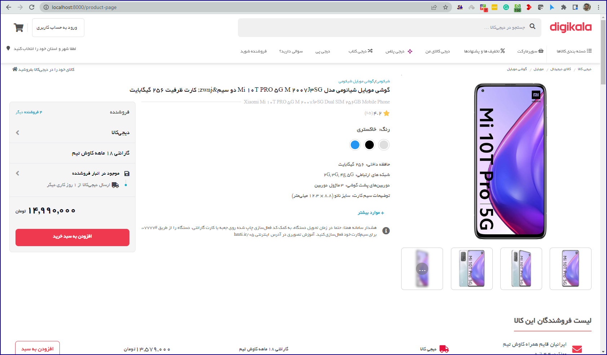

<p align="center"><a href="https://laravel.com" target="_blank"></a></p>

<p align="center">
<a href="https://travis-ci.org/laravel/framework"></a>
<a href="https://packagist.org/packages/laravel/framework"></a>
<a href="https://packagist.org/packages/laravel/framework"></a>
<a href="https://packagist.org/packages/laravel/framework"></a>
</p>

## About Project

Home page:


Product page:




## installation of this Project in your local pc
before installation:
 - install php & phpstorm & xampp 
 - install mysql & navicat
 - install git & sourcetree
 - install composer & npm 

 - clone this project from this repository with ```git clone https://github.com/saber13812002/digikala-laravel.git```
 - change directory into your new cloned directory with ```cd digikala-laravel```
 - run ```composer i```
 - run ```npm i```
 - create database in mysql (with navicat or any tools you have)
 - clone .env.example with new name ```.env```
 - edit env file with your mysql credentials, and your new db name
 - run php artisan migrate
 - run php artisan serve

## License

The Laravel framework is open-sourced software licensed under the [MIT license](https://opensource.org/licenses/MIT).
